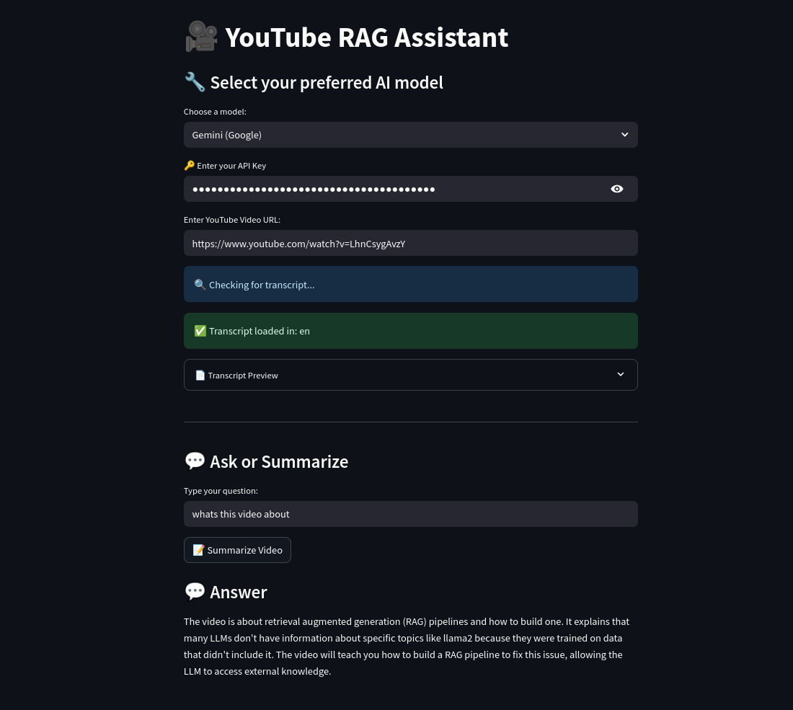
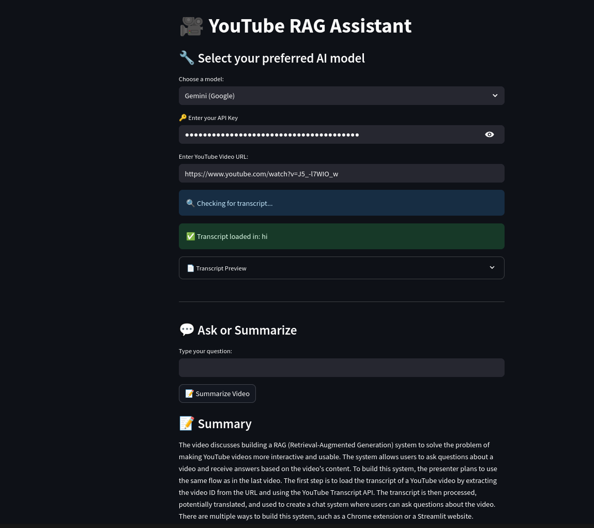

# 🎥 YouTube RAG Assistant

A Streamlit-based app that lets you ask questions or get a summary of **any YouTube video** using its transcript, powered by **RAG (Retrieval-Augmented Generation)**.

---

## 🚀 Features

- 🔗 Paste a YouTube URL and automatically extract the transcript
- 🌐 Supports **multi-language transcripts** (auto-translates to English for Q&A)
- 🤖 Choose between:
  - OpenAI (GPT)
  - Gemini (Google)
  - Ollama (local LLMs like llama3)
- 💬 Ask custom questions or auto-summarize the entire video

---

## 🔧 Setup Instructions

### 1. Clone the repo & install requirements

```bash
git clone https://github.com/Chaganti-Reddy/YT_RAG.git
cd YT_RAG
pip install -r requirements.txt
```

### 2. Run the app

```bash
streamlit run app.py
```

---

## Model Support

Currently, only the following models are supported:

| Model | Needs API Key | Notes |
| --- | --- | --- |
| OpenAI | ✅ Yes | Use GPT-3.5 or GPT-4 |
| Gemini | ✅ Yes | Uses raw API (faster than LangChain wrapper) |
| Ollama | ❌ No | Requires ollama installed locally & model pulled (ollama run llama3) |

## Folder Structure 

```bash
YT_RAG/
├── app.py                ← Streamlit UI
├── query_engine.py       ← QA chain logic
├── model_selector.py     ← Model switcher
├── retriever_utils.py    ← Vector store builder
├── transcript_loader.py  ← Transcript & translator
├── gemini_direct.py      ← Direct Gemini API call
├── requirements.txt
└── README.md
```

## Results



<br>



## Tips

1. Your questions must be in English (auto translation of transcript is handled).
2. Gemini API quotas are low on free tier — fallback to Ollama if needed.
3. Works great with videos that have auto-generated subtitles.

## Future Goals 

1. Add more models and their integrations.
2. Add more features, like audio transcription and multi-modal QA.
3. Add more support for different languages.

## Credits
- [LangChain](https://github.com/hwchase17/langchain)
- [Streamlit](https://streamlit.io/)
- [CampusX](https://www.youtube.com/@campusx-official)
